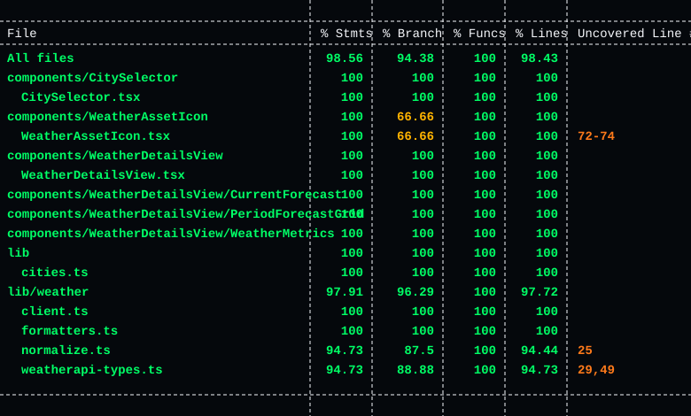

# TDSCompany Weather App

Aplicacao Next.js que exibe o clima atual e a previsao para cidades selecionadas.

## Requisitos

- Node.js 22 ou mais recente para desenvolvimento local
- Docker para executar em container
- Uma chave de API do WeatherAPI.com

## Ambiente

Crie um arquivo `.env.local` na raiz do projeto:

```bash
WEATHER_API_KEY=sua_chave_weatherapi_aqui
```

## Rodar Com Docker

Antes de construir a imagem, confira se o Docker Desktop esta aberto e em execucao.

Construa a imagem:

```bash
docker build -t tdscompany-weather-app .
```

Rode o container:

```bash
docker run --rm -p 3000:3000 --env-file .env.local tdscompany-weather-app
```

Acesse `http://localhost:3000`.

Ou use Docker Compose:

```bash
docker compose up --build
```

## Rodar Localmente

Instale as dependencias:

```bash
npm ci
```

Inicie o servidor de desenvolvimento:

```bash
npm run dev
```

Acesse `http://localhost:3000`.

## Build De Producao

Crie o build de producao:

```bash
npm run build
```

Rode o servidor de producao:

```bash
npm run start
```

## Testes

Rode a suite de testes:

```bash
npm test
```

Para verificar a cobertura dos testes:

```bash
npx jest --coverage
```

A suite cobre renderizacao dos componentes principais, normalizacao dos dados de clima, formatadores,
mapeamento de icones, busca de cidades e os fluxos de sucesso e erro do cliente da WeatherAPI.

Resultado atual da cobertura:


